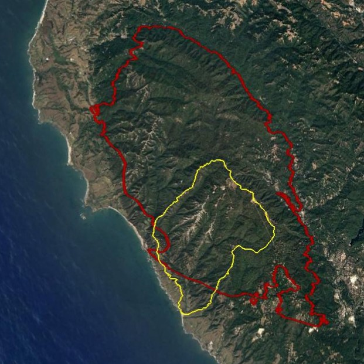
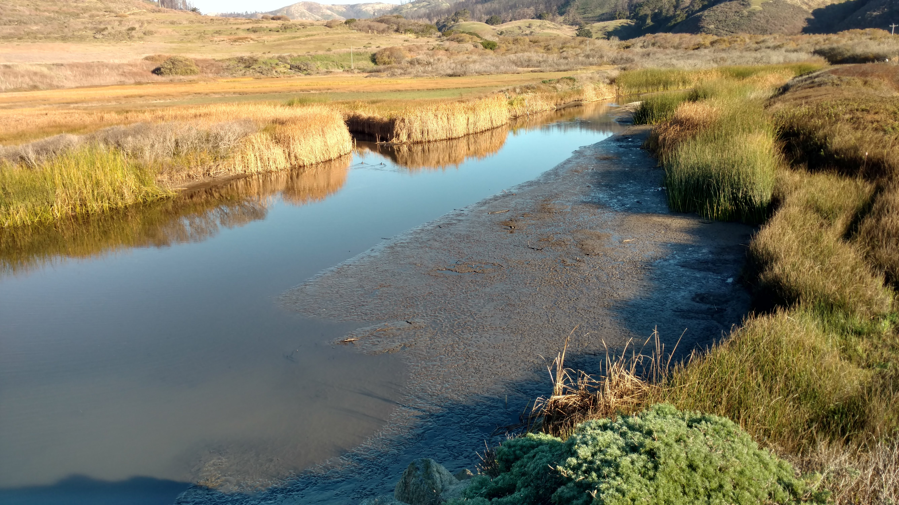
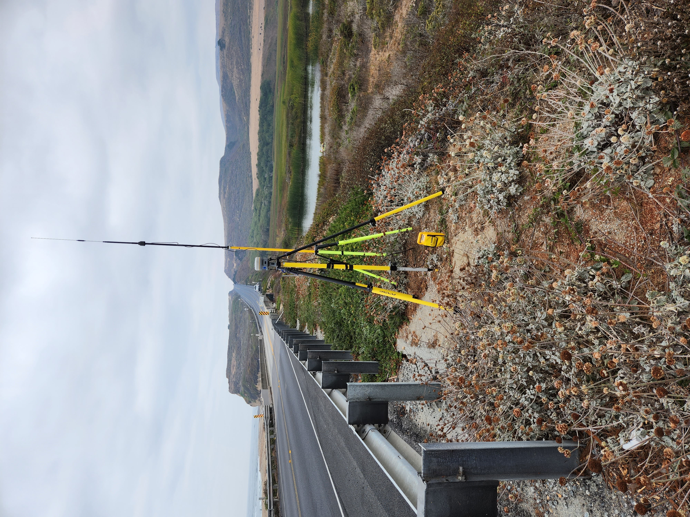
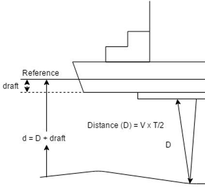

WY23 Scott Creek Estuary Bathymetric Survey
================
28 September, 2023

- [Introduction](#introduction)
- [Workflow Summary](#workflow-summary)
  - [Dataset Descriptions](#dataset-descriptions)
- [1. Field Notes](#1-field-notes)
- [2. Raw Data Corrections](#2-raw-data-corrections)
- [3. ~~Correct echosounder point depths to account for
  “draft”.~~](#3-correct-echosounder-point-depths-to-account-for-draft)
- [4. Remove bad topo points and echo points that are too shallow or
  have low
  accuracy.](#4-remove-bad-topo-points-and-echo-points-that-are-too-shallow-or-have-low-accuracy)
- [5. Calculate bed surface elevation (BedSE) from echosounder
  points.](#5-calculate-bed-surface-elevation-bedse-from-echosounder-points)
- [6. Calculate water surface elevation (WaterSE) from echosounder
  points.](#6-calculate-water-surface-elevation-waterse-from-echosounder-points)
- [7. Corrected Output Files](#7-corrected-output-files)
- [8-10. in ArcMap (outside of R).](#8-10-in-arcmap-outside-of-r)

<!-- README.md is generated from README.Rmd. Please edit that file -->

# Introduction

In August 2020, the CZU Lightning Complex fires burned more than 350 km2
(86,500 acres) of coastal forests and hills in the Santa Cruz Mountains
region (Santa Cruz and San Mateo counties, California). Among the
watersheds severely affected by wildfire was Scott Creek, a small (70
km2) coastal basin ~80 km south of San Francisco Bay.

<center>

<figure>

<figcaption aria-hidden="true">Fig. 1 Approximately 87% of the Scott
Creek Watershed (yellow outline) was within the CZU Lightning Complex
fire perimeter (red outline).)</figcaption>
</figure>

</center>

The Scott Creek watershed is of special management concern as it
supports the southernmost extant population of coho salmon
(*Oncorhynchus kisutch*; Central California Coast \[CCC\] evolutionarily
significant unit) in North America, as well as federally threatened CCC
steelhead (anadramous *O. mykiss*). Scott Creek is also the location of
a salmonid life cycle monitoring station operated jointly by NOAA’s
Southwest Fisheries Science Center ([FED project
website](https://www.fisheries.noaa.gov/west-coast/science-data/landscape-and-seascape-ecology-research-california-salmon))
and the University of California, Santa Cruz Fisheries Collaboration
Program ([FCP project
website](https://fisheries.ucsc.edu/research-teams/scott-creek/)).
Extensive physical, chemical, and biological monitoring conducted
throughout the Scott Creek watershed since 2002 provides a unique
opportunity to rigorously examine the direct and indirect effects of
wildfire on salmonid productivity and carrying capacity.

<center>

<figure>

<figcaption aria-hidden="true">Fig. 2 Fine sediment deposited on the
margins of the Scott Creek Estaury/Lagoon (Photo: November
2021).</figcaption>
</figure>

</center>

Water Year 2023 (WY23) had large flushing flows which moved large
amounts of sediment throughout the mainstem. We believe course sediment
reached the Scott Creek Estuary/Lagoon whereas most fine sediment
reached the area in WY2022 (right figure shows fine sediment deposition
in the estuary 30 November 2021). This repository focuses on data
collected on 22 September 2023 in the Scott Creek Estuary/Lagoon and a
separate repository is dedicated to the [WY2022
data](https://github.com/RMBond/ScottCreek-WY22_LagoonBathymetry). Our
goal was to survey the estuary using RTK GPS and create a bathymetric
surface. Ultimately we hope to track how this habitat changes over time
and answer the question “How much has the Scott Creek estuary/lagoon
filled in with fine sediment and re-scoured compared to pre-fire
conditions?”.

# Workflow Summary

The general workflow is:

1.  Collect topo and echo sounder points.

2.  Extract data from the R10s and correct raw data with OPUS output (if
    needed).

3.  ~~Correct echosounder point depths to account for “draft”~~ (Done).

4.  Remove bad topo points and echo points that are too shallow or have
    low accuracy.

5.  Calculate bed surface elevation (BedSE) from echosunder points
    (Note: topo points are corrected in step 4).

6.  Calculate water surface elevation (WaterSE) from echosounder points.

7.  Make Corrected Output Files.

8.  Share with collaborators.

<br>

## Dataset Descriptions

The <span style="color:purple">*Data*</span> folder contains all of the
rtk datasets used in this repository. The raw and output datasets can be
found in their corresponding folders.

*Uncorrected* Base Station Files:

1.  The
    <span style="color:purple">*Raw_Data/Scott_Blue_230922.csv*</span>
    datafile contiants the keyed in base station point (based on WY22
    OPUS correction, see field notes below).

2.  The <span style="color:purple">*OPUS/727726251.o*</span> datafile is
    the *uncorrected* base station RINEX file that can be submitted to
    OPUS for double checking the correction.

*Uncorrected* Rover Files:

3.  The
    <span style="color:purple">*Raw_Data/Scott_Grn_230922.csv*</span>
    datafile consists of the *uncorrected* green rover topo points.

4.  The echosounder points were broken into two job files to reduce file
    size (this was a challenge in WY22).
    <span style="color:purple">*Scott_Red_230922.csv*</span> and
    <span style="color:purple">*Scott_Red2_230922.csv*</span> datafiles
    consists of the *uncorrected* red rover topo and echosounder points.
    The depth and accuracy fields were extracted by L. Harrison using
    Trimble Business Center software.

<span style="color:blue">*Corrected*</span> Rover Files:

5.  The
    <span style="color:purple">*Output_Data/OUT.FullDataset_Corrected_xxx*</span>
    datafile is the full (all rtk points) dataset. It can be used as a
    starting point for any analysis.

6.  The
    <span style="color:purple">*Output_Data/OUT.BedSurface_Corrected_xxx*</span>
    datafile is the bed surface input file (topo, wse, and echosounder
    point) for making TIN and raster files in ArcMap. Note the WaterSE
    column has been removed (not needed).

7.  The
    <span style="color:purple">*Output_Data/OUT.WaterSurface_Corrected_xxx*</span>
    datafile is the water surface input file (wse and echosounder point)
    for making TIN and raster files in ArcMap. Note the BedSE column has
    been removed (not needed).

<br>

# 1. Field Notes

On 22 September 2023, R. Bond and A. Hay surveyed the estuary with three
RTK units (Trimble R10’s). Each unit has its own raw data file
(described above) which are used in the workflow (steps above). A
google-drive folder with a scan of the field notebook and photos can be
found
[here](https://drive.google.com/drive/u/1/folders/1JAJvtO_taK0N5950DzGwYt7C-WTqHhzp).



Survey Notes:

- Survey Units: Meters;

- Horizontal Datum: NAD83 10 North

- Vertical Datum: Conus GEOID12A.

- Survey extent: Scott Creek State Beach inland to Queseria Creek
  confluence. Most topo points were collected from the beach to the
  north marsh area (bad signal just upstream of the Lagoon PIT antenna
  array). Echosounder points focused on the main channel from the beach
  (downstream side of Hwy 1 bridge) to Queseria Creek confluence.

- Blue Unit - Base station.

  - Settup on ESA CP02 and ran for ~5 hours (same point as WY22).
  - Antenna height to quick release = 1.5m.
  - Job Name: Scott_blue_230922.
  - Keyed in base coordinates based on WY22 OPUS correction and 1cm
    added to elevation (Z) to account for slightly different GEOID
    models (OPUS used CONUS2018 and we used CONUS2012)
    - N = 4099614.797m
    - E = 568610.850m
    - Z = 8.382m

- Green Unit - Rover collecting topo points

  - Antenna height to quick release = 2.0m (one rod = 1.05m).
  - Job Name: Scott_grn_230922.
  - Shot to ESA CP01 for check point.
  - Started topo survey at point \#7.
  - Raw Data Corrections:
    - Delete points 793 (bad wse).

- Red Unit - Rover collecting echosounder points (Sonarmite; wet areas
  with depth).

  - Antenna height to quick release = 1.252m.
  - Job Name: Scott_red_230922.
  - Sounder depth in water (a.k.a. “Draft”) = 0.27m.
  - Code = echo.
  - Job 1: Started at point number 1000 and stoped at point 5446.
  - Job 2: Started st point number 5500 and stoped at point 7022. (Used
    same antenna height and draft as Job 1).
  - Draft was keyed into the unit so Trimble dusiness Center software
    applied this amoutn to the depth measurments. Therefore the draft
    correcting step is not needed.

- Survey Codes:

  - levee - top of levee.
  - topo - combination of wet and dry topographic points.
  - rock - armouring at Hwy 1 bridge (“Jacks”)
  - wse - Water Surface Elevation at the edge of bank (transition from
    wet to dry).
  - echo - wet echosounder point (need to incorperate depth measurments
    to elevation to get BSE).

- The mouth was open during the survey (so reffering to estuary rather
  than lagoon). Mouth runs north to blufs and spills onto the reef.
  There is a mudstone ledge that is acting as an elevation control
  (despite water being able to still flow out). The wetted area and
  depth looks comparable to previous water years.

- The North marsh and South pond were wet during the survey (pre-fire
  times this was rare in the late summer).

<br>

# 2. Raw Data Corrections

When starting the base station we “used a”here” “keyed in” the point
using WU22 OPUS correction (coordinates above).

\####START WORKING ON CODE HERE \####

<br>

``` r

#Load packages
library(ggplot2)
library(dplyr)
library(lubridate)
library(patchwork)

options(digits = 10) #Global option so you can see the entire number for Northings and Eastings.


#### Goal: Correct raw data with OPUS correction.

#Read in RTK files
Green.dat <- read.csv('Data/Raw_Data/SC_grn_xxx.csv', sep = ",", header = T) # Topo points (362 obs, 5 var).
Red.dat <- read.csv('Data/Raw_Data/SC_red_xxx_withdepth.csv', sep = ",", header = T) # Echosounder points (11772 obs, 21 var).

#Make sure the data are loaded correctly
str(Green.dat)
str(Red.dat) #Looks Good.

#OPUS Correct datasets:
#Topo Points:
Green.opus <- Green.dat %>% 
  mutate(North_cor = North + 6.557,
         East_cor = East - 3.309,
         Elevation_cor = Elevation - 2.348) %>% 
  select(Point, North_cor, East_cor, Elevation_cor, Code) # 359 Obs of 5 var.
      
#Echosounder Points:
Red.opus <- Red.dat %>% 
  mutate(North_cor = North + 6.557,
         East_cor = East - 3.309,
         Elevation_cor = Elevation - 2.348) %>% # Apply OPUS correction
  select(Point, North_cor, East_cor, Elevation_cor, Depth, Code, VertPrec) #Note: Elevation and Depth are adjusted further below. # 11772 obs of 7 var.
  
  
```

<br>

# 3. ~~Correct echosounder point depths to account for “draft”.~~



The sounding instrument is mounted slightly into the water. This little
bit of depth, known as “draft”, typically needs to be added to all of
the depth values to get total water depth (d in figure to the right).
NOTE DRAFT WAS KEYED INTO THE TSC3 AND HAS ALREADY BEEN APPLIED TO THE
DEPTH POINTS. THEREFORE THIS STEP IS SKIPPED FOR THIS WATER YEAR’S
SURVEY.

# 4. Remove bad topo points and echo points that are too shallow or have low accuracy.

Point filters:

- Topo points were removed based on fieldnotes.

- Echosounder points were removed based on a vertical precision
  threshold = 0.03cm and sounding depths less than 0.4m (the shallowest
  depth a return could be detected by the sonarmite).

``` r

#### Goal: Correct topo and echosounder points based on field notes and echo sounder point accuracy.

#Topo points:
Green.cor <- Green.opus %>%
  mutate(BedSE = Elevation_cor) %>% #Renaming since these topos are bed surface elevation.
  select(-Elevation_cor) %>%        #Removing old named column.
  filter(Point != "BASE",
         Point != 337,
         Point != 345)  #Remove three points.

Green.cor$Code[Green.cor$Point == 7] <- "topo"
Green.cor$Code[Green.cor$Point == 108] <- "topo"
Green.cor$Code[Green.cor$Point == 109] <- "topo"
Green.cor$Code[Green.cor$Point == 163] <- "topo"
Green.cor$Code[Green.cor$Point == 164] <- "topo" #Change code form WSE to topo.

# 359 Obs of 5 var.

#Corrected topo point dataset:
# write.table(Green.cor, file = 'Data/Output_Data/OUT.Green_Corrected_20221005.csv', sep = ',', row.names = F)

#Remove echosounder points based on vertical precision threshold between 0.09 - 0.16ft and depths less than 1.3ft.
Red.cor <- Red.draft %>% 
  filter(Code == "echo",  #Remove non-echo points. #11769 obs
         VertPrec < 0.09, #Remove points based on vertical precision threshold #11067 obs
         Depth_cor > 1.3) #Remove shallow points #10977 obs

#10977 obs of 7 var.
```

# 5. Calculate bed surface elevation (BedSE) from echosounder points.

BedSE = OPUS corrected elevation + draft corrected depth.

``` r

####Goal: Combine elevations with depth to get BedSE.

Red.cor2 <- Red.cor %>%
  mutate(BedSE = Elevation_cor + Depth_cor)

#10977 obs. of 8 var.
```

# 6. Calculate water surface elevation (WaterSE) from echosounder points.

Water SE (for the echosounder points) = Elevation_cor - draft (0.650
ft).

- Echosounder points can be used as water surface elevation refrences
  (i.e., Z point used in water surface TIN).

- “wse” points (collected by the green rover) indicated the wetted
  margin on the bank (i.e., X,Y,Z can be used in bed and water surface
  TINs). The wse points are important for creating the wetted boundary
  wihtin the lagoon.

``` r

Red.cor3 <- Red.cor2 %>% 
  mutate(WaterSE = Elevation_cor - 0.65) %>% 
  select(Point, North_cor, East_cor, BedSE, WaterSE, Depth_cor, Code, VertPrec) #remove old elevation column.

#10977 obs. of 8 var.

#Corrected echosounder dataset:
# write.table(Red.cor3, file = 'Data/Output_Data/OUT.Red_Corrected_20221005.csv', sep = ',', row.names = F)
```

# 7. Corrected Output Files

``` r

####Goal: Join the RTK data together into a single dataset.

#Pull out topo WSE points and put them into the WaterSE column.
Green.cor.wse <- Green.cor %>%
  filter(Code == "wse") %>% 
  mutate(WaterSE = BedSE) # Make bed = water surface elevation since this is the wetted margin (used for water surface layer TIN below).
#79 obs of 6 var.

Green.cor.topo <- Green.cor %>%
  filter(Code != "wse") #280 of 5 var.

Green.join <- full_join(Green.cor.topo, Green.cor.wse) #rejoin topo points #359 obs of 6 var.

#### OUTPUT - Full Dataset Output ####
RTKData <- full_join(Green.join, Red.cor3) %>% 
  select(Point, North_cor, East_cor, BedSE, WaterSE, Depth_cor, Code, VertPrec) #join topo and echosounder points #11336 obs of 8 var.

#Full corrected dataset:
# write.table(RTKData, file = 'Data/Output_Data/OUT.FullDataset_Corrected_20221007.csv', sep = ',', row.names = F)

####  OUTPUT - Bed Surface TIN layer ####
BedData <- RTKData %>%
  filter(Code != "cp01",
         Code != "bridge",
         Code != "cb01b",
         Code != "hwymark",
         Code != "cpx") %>% #removing extra points that only matter to the base settup.
  select(North_cor, East_cor, BedSE, Code, Point, VertPrec) #Don't need these columns for bed TIN.
  
#11331 obs of 6 var.
  
#Bed Surface Points Only (Topo, echo, and wse = basic channel bed TIN for making ArcMap raster)
# write.table(BedData, file = 'Data/Output_Data/OUT.BedSurface_Corrected_20221007.csv', sep = ',', row.names = F)

####  OUTPUT - Water Surface TIN layer ####

WaterData <- RTKData %>%
  filter(Code == "wse"| Code == "echo") %>% #only water points.
  select(North_cor, East_cor, WaterSE, Code, Point, VertPrec) #11056 of 6 var.

#Water Surface Points Only (wse and echo = basic water surface TIN for visualizing depths in ArcMap raster)
# write.table(WaterData, file = 'Data/Output_Data/OUT.WaterSurface_Corrected_20221007.csv', sep = ',', row.names = F)
```

Some summaries:

``` r
#Goal: Summarise point types and range of depths.

RTKData.sum <- RTKData %>%
  filter(Code != "cp01",
         Code != "bridge",
         Code != "cb01b",
         Code != "hwymark",
         Code != "cpx") %>% 
  group_by(Code) %>% 
  summarise(n())

Depth.plot <- ggplot(RTKData, aes( x = Depth_cor)) +
  geom_histogram(binwidth = .5)+
  theme_classic() +
  scale_x_continuous("Depth (ft)", limits = c(1,6), 
                     breaks = c(1,2,3,4,5,6), 
                     labels = c(1,2,3,4,5,6),
                     expand = c(0,0))
# ggsave("Figures/Depth_Histogram_20221006.jpg", width = 5, height = 3, units = "in", dpi = 650, device = "jpg")
```

<center>

<figure>

<figcaption aria-hidden="true">Fig. X Histogram of echosounder depths
after post-processing (Min = 1.66ft, Max =5.8ft ).</figcaption>
</figure>

</center>

# 8-10. in ArcMap (outside of R).

8.  Convert BSE points into TIN layer(in ArcMap).

9.  Convert TIN to raster layer (in ArcMap).

10. TBD - Compair WY22 layer to ESA Dec 2016 layer. Raster or TIN
    differencing (in ArcMap? or R?).
